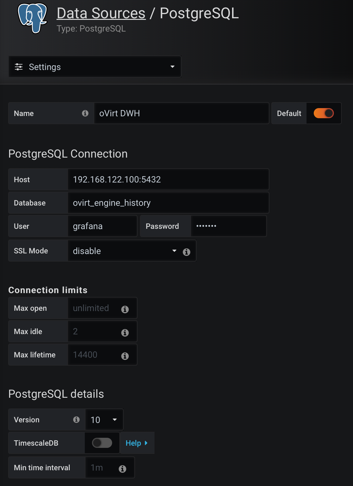

Following steps allow you to set up Grafana Monitoring for your oVirt 4.3 environment and re-use Grafana Dashboards from latest oVirt 4.4 on a previous release.

### Allowing Grafana to connect to oVirt DWH database (Data Warehouse)
Login to the oVirt engine 4.3 and create a user *"grafana"* with password *"grafana"* that will get a read-only access to the ovirt_engine_history database and will be able to use `public` schema
```
# su - postgres -c 'scl enable rh-postgresql10 bash'
# psql -U postgres -c "CREATE ROLE grafana WITH LOGIN ENCRYPTED PASSWORD 'grafana';" -d ovirt_engine_history
# psql -U postgres -c "GRANT CONNECT ON DATABASE ovirt_engine_history TO grafana;"
# psql -U postgres -c "GRANT USAGE ON SCHEMA public TO grafana;" ovirt_engine_history
```
Generate the rest of the permissions that will be granted to the newly created user and save them to a file:
```
# psql -U postgres -c "SELECT 'GRANT SELECT ON ' || relname || ' TO grafana;' FROM pg_class JOIN pg_namespace ON pg_namespace.oid = pg_class.relnamespace WHERE nspname = 'public' AND relkind IN ('r', 'v');" --pset=tuples_only=on  ovirt_engine_history > grant.sql
```
Use the file you created in the previous step to grant permissions to the newly created user:
```
# psql -U postgres -f grant.sql ovirt_engine_history
```
Remove the file you used to grant permissions:
```
# rm grant.sql
```
Exit the postgres user shell by pressing `Ctrl+d`

Add the following lines for the newly created user to /var/opt/rh/rh-postgresql10/lib/pgsql/data/pg_hba.conf preceding the line beginning local all all
```
host    ovirt_engine_history grafana 0.0.0.0/0               md5
host    ovirt_engine_history grafana :0/0                    md5
```

Reload postgres service
```
# systemctl reload rh-postgresql10-postgresql
```

### Installing Grafana
You can install Grafana directly on the oVirt Engine machine (this is how it's done in oVirt 4.4) or on a separate machine. 
Following steps shows how you can install Grafana on a separate Oracle Linux 7 server. 
Note: Oracle provides Grafana in the OLCNE yum repository - you only need to install repository definition package to pickup Grafana and it's dependencies. 
```
# yum install oraclelinux-release-el7
# yum install oracle-olcne-release-el7
# yum-config-manager --enable ol7_optional_latest ol7_olcne11
# yum install grafana
# systemctl enable --now grafana-server
```

### Adding oVirt DWH database as Data Source in Grafana
Login to Grafana (default port 3000) and navigate to `Configuration` -> `DataSources` and click on `Add Data Source` button.

Select **PostgreSQL** source and use the following settings (adjust the Host IP address to match your oVirt Engine IP ):



### Importing Dashboards from oVirt 4.4
Download Grafana Dashboards from oVirt 4.4 repository: https://github.com/oVirt/ovirt-dwh/tree/master/packaging/conf/grafana-dashboards

You can now import them in Grafana by naviating to `Create` -> `Import` and clicking on `Upload .json file` or by simply pasting JSON content.

### Testing the integration with ready to use Grafana Docker container
If you would like to quickly test the integration you can use the grafana-container definition available in this repository.

Just clone this repository to your server
```
$ git clone https://github.com/michalgutowski/ovirt-grafana
$ cd ovirt-grafana
```
Edit the DataSource definition file and adjust the Host IP/URL address of you oVirt engine machine. 
```
$ vi grafana-container/provisioning/datasources/all.yml
```
Finally, build and run the container.
```
$ docker build -t grafana-container grafana-container
$ docker run -d -p 3000:3000 grafana-container
```

#### Sources
https://www.ovirt.org/documentation/data_warehouse_guide/#Allowing_Read_Only_Access_to_the_History_Database
https://github.com/oVirt/ovirt-dwh/

